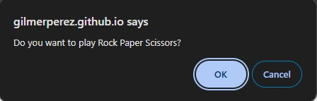

# Rock, Paper, Scissors

## Project Overview

This project involves building a game of Rock, Paper, Scissors using only JavaScript. Users can play against an automated opponent, track their results, and analyze their choices.

## Table of Contents

- [Usage](#usage)
- [Mock Up](#mock-up)
- [Instructions](#instructions)
- [Key Features](#key-features)
- [Technology Stack](#technology-stack)
- [Additional Resources](#additional-resources)

## Usage

Open the `index.html` file to view the landing page and test its functionality.

## Mock-Up

The following image shows the web application's appearance and functionality:

## Instructions

The application should meet the following criteria:
1. Users can enter **R**, **P**, or **S** to signify their choice of rock, paper, or scissors.
2. The computer's choice is randomly generated for a fair game.
3. Users will be prompted if they enter an invalid choice.
4. After each round, users have the option to play again.
5. At the end of the game, users can view their total wins, losses, ties, and how many times they chose each option.

## Key Features

* **Replay Option:** Allows users to play multiple rounds.
* **Player Input:** Users can input their choice via `prompt()`.
* **Game Tracking:** Tracks total wins, ties, and losses for the player.
* **Random Computer Choice:** The computer generates a random choice using JavaScript's `Math.random`.
* **Detailed Statistics:** Displays the count of each user choice (e.g., how many times they chose rock, paper, or scissors).

## Technology Stack

This project uses the following technologies:
* **JavaScript:** Powers the game logic, random choice generation, and user interaction.
* **Browser Alerts and Prompts:** Utilizes `alert()`, `prompt()`, and `confirm()` for user interaction.

## Additional Resources

Learn more about generating random numbers: [MDN Web Docs on Math](https://developer.mozilla.org/en-US/docs/Web/JavaScript/Reference/Global_Objects/Math)

Learn more about how to use `alert()` for notifications: [MDN Web Docs on alert()](https://developer.mozilla.org/en-US/docs/Web/API/Window/alert)

Learn more about how to use `prompt()` for user input: [MDN Web Docs on prompt()](https://developer.mozilla.org/en-US/docs/Web/API/Window/prompt)

Learn more about how to use `confirm()` for user confirmation: [MDN Web Docs on confirm()](https://developer.mozilla.org/en-US/docs/Web/API/Window/confirm)

